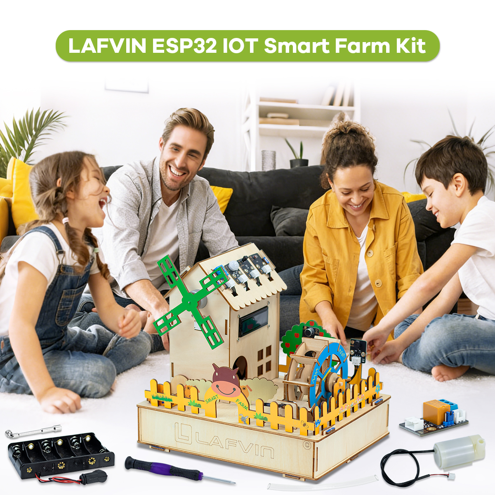
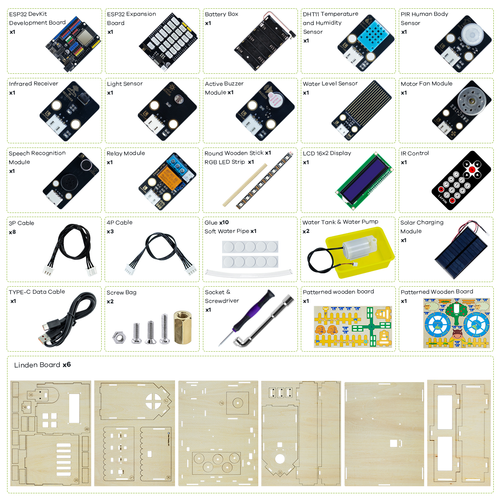

Introduction
============

**Welcome to ESP32-IOT-SmartFarm-kit**

----

- This smart farm development kit uses a high-performance ESP32 development board as its core control unit and employs modular components with standard 2.54mm pitch interfaces for easy connection and expansion. 

- The system supports three interaction methods: infrared remote control, voice control, and control via an app.Users can easily manage various farm equipment, such as water pumps, lighting, and fan operation. 

- By learning Arduino programming and remote real-time operation via the mobile app, users can not only experience the intelligent control benefits of IoT technology firsthand but also gain a deeper understanding of the complete collaborative working mechanism of sensor perception, data communication, and actuator linkage, thereby mastering the core principles and application methods of IoT systems.

----

Bill of Materials
-----------------

The following table lists all components included in the **ESP32-IOT-SmartFarm-kit**. Please check carefully to ensure that all parts are complete before starting.  

----

Function Introduction
---------------------

**Automatic Control Mode:**

Ambient Light Sensor: Automatically turns on white supplemental lighting when light levels are below a threshold, simulating nighttime lighting for plants.

Intelligent Security Linkage: Automatically triggers a buzzer alarm when human activity is detected under low light conditions, providing nighttime anti-theft functionality.

Temperature-Controlled Ventilation: Automatically starts and stops fans according to preset temperature thresholds, achieving intelligent adjustment of ambient temperature.

Environmental Monitoring and Display: Real-time collection of temperature, humidity, light, and water level data, dynamically updated and displayed on the LCD1602 screen.

**Infrared Remote Control:**

One-button global control of fans, water pumps, and RGB lights is possible via remote control buttons.

Independent on/off operation of each device is also supported, flexibly adapting to different scenario needs.

Switching between three RGB lighting effects, enabling/disabling alarm modes, and setting thresholds for temperature-controlled fans.

**SPEECH Recognition Control:**

Supports direct control of fans, water pumps, and RGB lights via specific voice commands, achieving a hands-free intelligent interactive experience.

**APP Control:**

Real-time monitoring and display of environmental data such as temperature, humidity, light intensity, water level, and human presence.

Supports remote control of RGB lights, with independent adjustment of red, green, and blue brightness.

Remotely starts and stops fans and water pumps, enabling comprehensive mobile management of farm equipment.

----

Resource Download
-----------------

All the necessary code and library files for this course are provided. You can obtain all the resources through the following link.

`Code and Libraries <https://www.dropbox.com/scl/fo/sl9z0sjm05r91bp1ydpow/ADg7koIZM07COmi8Y_GyPWE?rlkey=odmym388yz5bqwd5xhbzzn2zi&st=4w7j8l23&dl=1>`_

`Flash Download Tool <https://www.dropbox.com/scl/fo/r81afjixw65y88jikwxno/AM8XTGDtfcEJDgN0jHyMbRY?rlkey=4lvaoh0axd9nhvk9al7qukoi5&st=1hqtehms&dl=1>`_

`CH340 <https://www.dropbox.com/scl/fo/c4bb59fr42qcs9cxgexan/AIMImtqevecMqYNMJVK1ZBM?rlkey=9afntuwy2usxfxbl7xjkoirsy&st=89a5bx6b&dl=1>`_

----

