Burn The Program
================

**The ESP32 development board in this kit is not pre installed at the factory, so there will be no response after power on.** 

**Please burn the program for the development board according to the following tutorial to quickly experience all the functions of the suite.**

----

.. _Install Serial Port Tool:

1. Install Serial Port Tool
---------------------------

This kit uses an ESP32 development board with a CH340 serial port chip. The corresponding driver needs to be installed before connecting it to the computer for the first time. If you have already installed the CH340 driver, you can skip this step and proceed directly to the next section.

----

In the resource folder provided by this package, locate the "CH340 driver installation package" and follow the instructions in the image below to complete the installation.

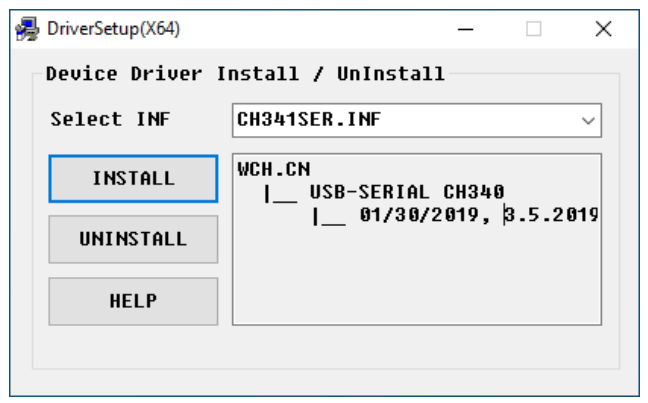

.. raw:: html

   

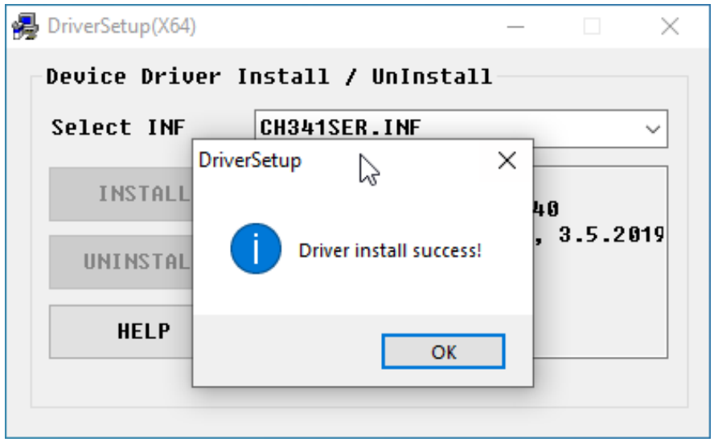

----

After installation, please connect the ESP32 development board to your computer using a Type-C data cable and check in Device Manager whether the serial port is successfully recognized（as shown in the image below）. If it is not recognized, please try changing the USB port or reinstalling the driver.

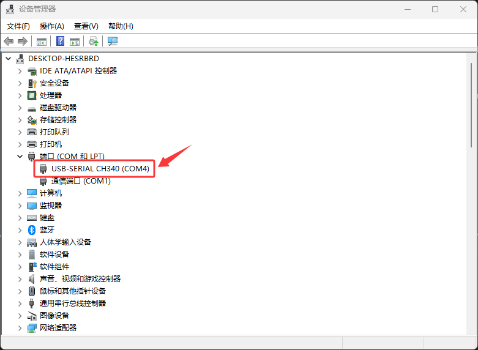

----

2. Install Flash Download Tool
------------------------------

Please locate and open the "Flash Download Tool" installation package from the resource files we provided, and then follow the image instructions below to complete the installation.

----

Unzip "Flash Download Tool". The folder contains the following files. Double-click to open the program "flash_download_tool_XXXX".

.. image:: _static/install/4.TOOL.png
   :width: 800
   :align: center

----

3. Burn The Program To ESP32 
----------------------------

3.1 Please double-click to run the "flash_download_tool" program. After starting, you will see the software interface as shown in the image below. In the "Chip Type" selection box on the interface, please find and select "ESP32".

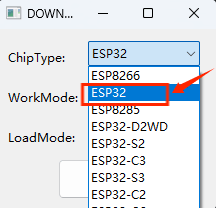

----

3.2 Please carefully check that all parameters are configured correctly according to the image before clicking "OK" to confirm. The system will then redirect to the programming interface.

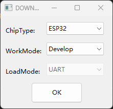

----

3.3 Import the firmware following the steps shown in the image.

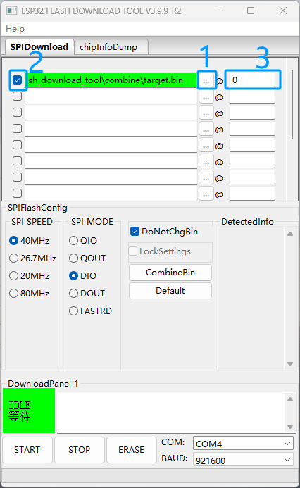

.. raw:: html

   

.. note::

   - The firmware can be downloaded from the resources we provide
   
   - The storage path is: Code and Library — Code — 0.Smart_Farm — 0.Smart_Farm.bin

 .. image:: _static/install/11.code.png
   :width: 800
   :align: center

----

3.4 Set the parameters as shown in the picture: SPI SPEED select 80MHz, SPI MODE select DIO, COM select the serial port actually connected to the computer, and BAUD set to 921600.

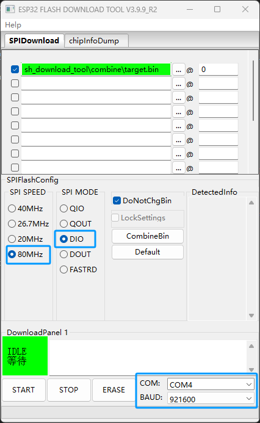

----

3.5 After completing the above settings, click the START button and the system will automatically start burning the firmware. Please wait patiently for the burning to complete.

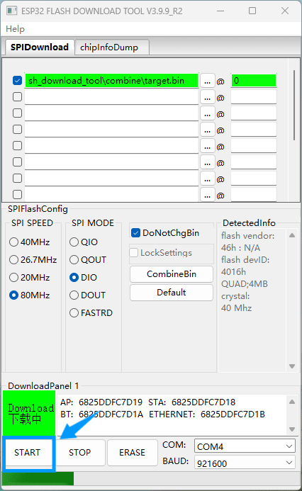

----

3.6 After the burning is completed, the interface will display the FINISH prompt. At this time, press the RST reset button on the ESP32 development board and the system will start running.

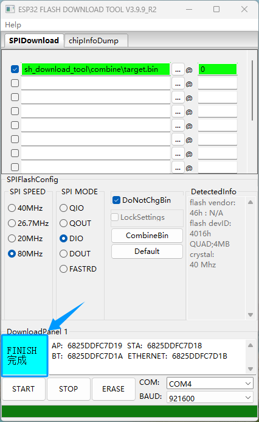

----

.. note::

   If the flashing process fails, please follow these steps:

   - Confirm that the ESP32 development board is properly connected to the computer via a USB cable and that the CH340 driver is installed.
   - Check that COMx in the flashing tool is the actual serial port number.
   - Confirm that the firmware file is correctly placed in the BIN folder and check the box on the left.
   - Verify the flashing parameter settings: SPI SPEED = 80MHz, SPI MODE = DIO, BAUD = 921600.
   - Try changing the USB cable or USB port to eliminate communication issues.
   - If flashing still fails, restart the computer and development board and try again.

----

LAFVIN Web Flasher 
-------------------

Of course, you can also use **LAFVIN Web Flasher** to directly burn programs, which is more convenient and faster.

----

The firmware for this kit is already integrated into LAFVIN Web Flasher. You can quickly burn the program by following these steps.

1. Similarly, you need to install Serial Port Tool first. See the previous instructions for detailed installation steps; if you have already installed it, skip this step.

2. Connect the ESP32 development board to your computer using a data cable. Click here to go to LAFVIN Web Flasher. `LAFVIN Web Flasher <https://lafvintech.github.io/Lafvin_Web_Flasher/>`_

.. raw:: html

   

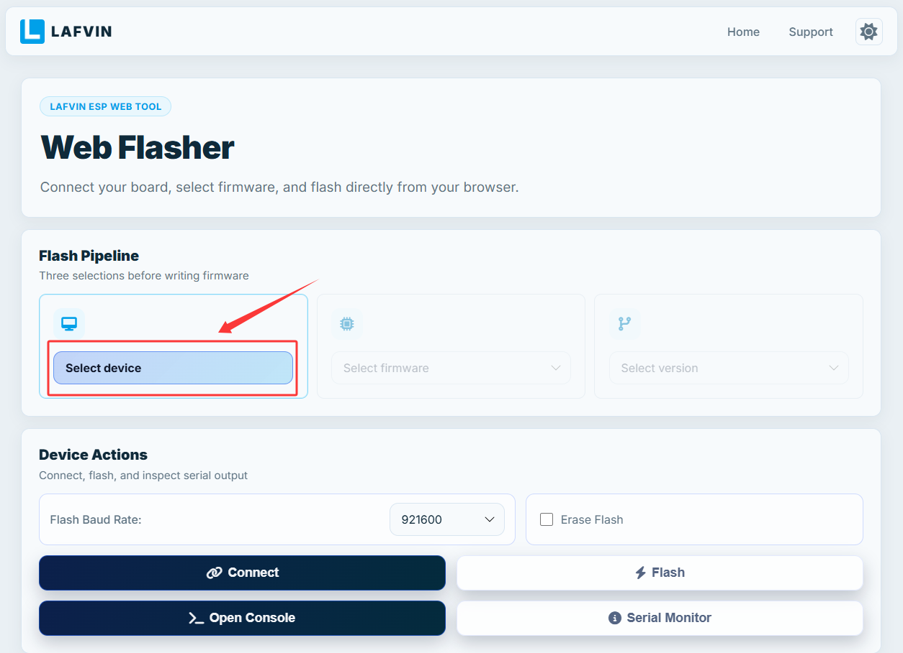

.. raw:: html

   

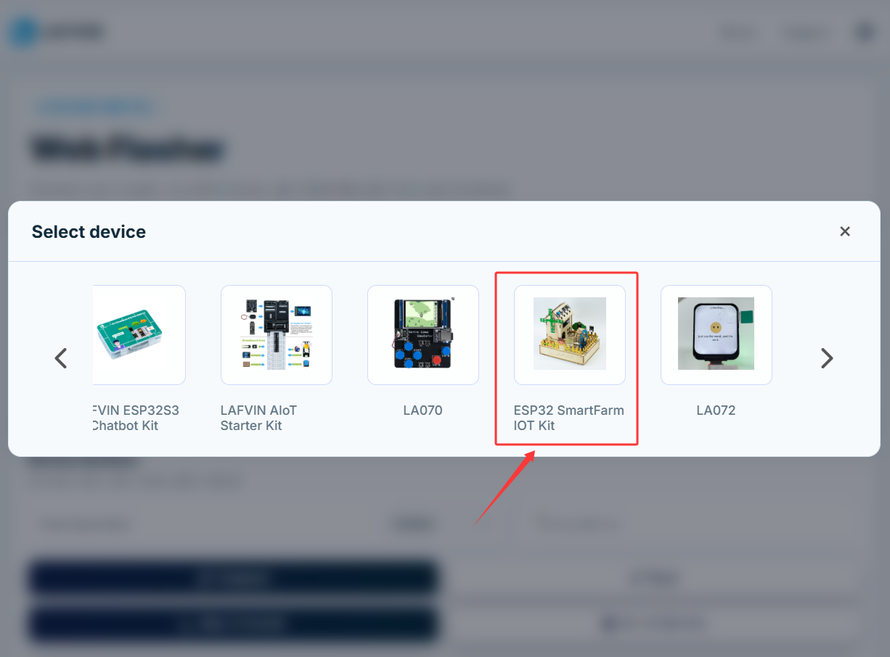

.. raw:: html

   

3. Click **Select device** and choose **ESP32 SmartFarm IOT Kit**.

.. raw:: html

   

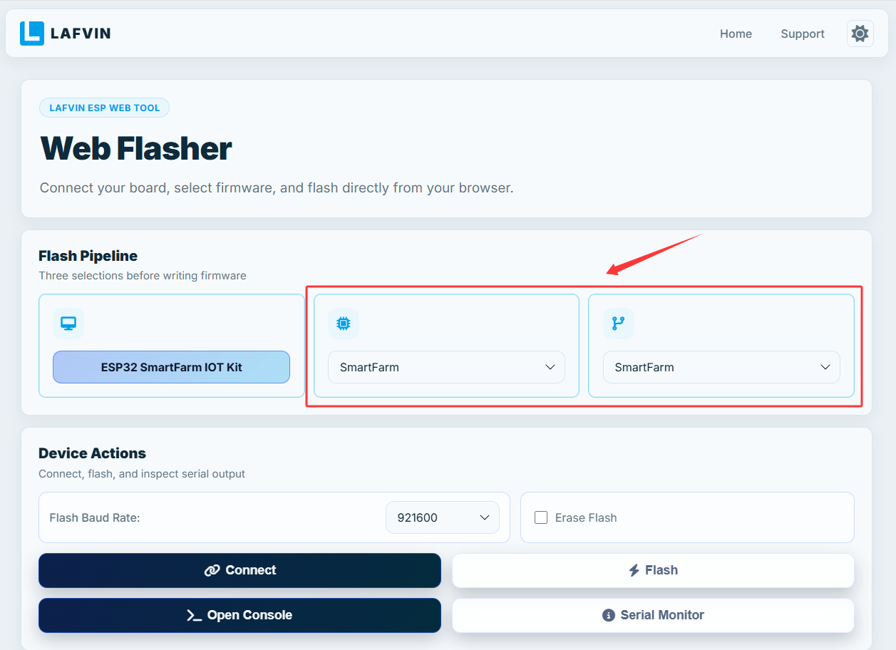

.. raw:: html

   

4. Select **smartfarm** for both chip and firmware versions.

.. raw:: html

   

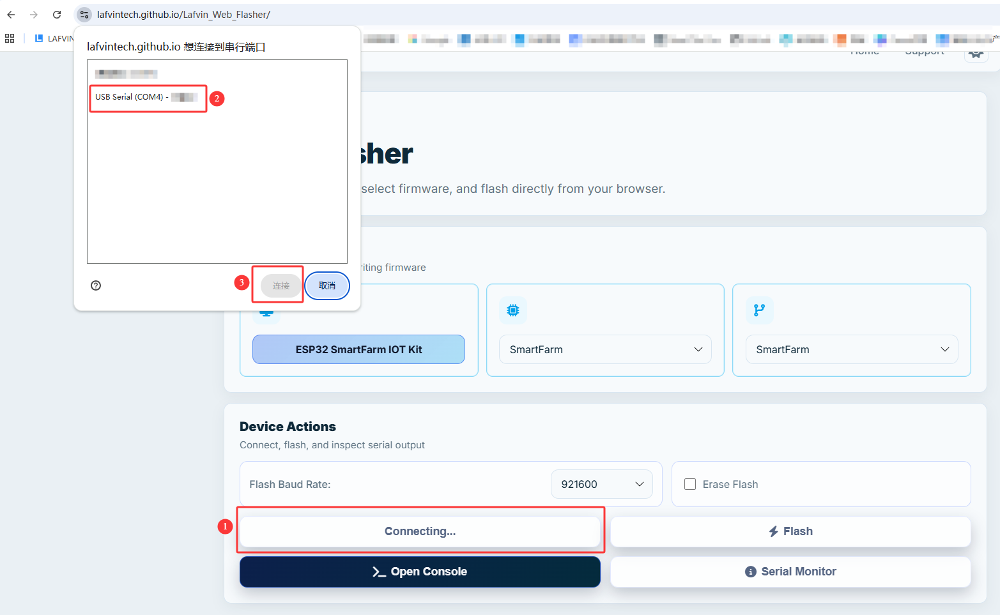

.. raw:: html

   

5. Click **connect** select the corresponding serial port from the pop-up devices list, and click **connect**.

.. note::

   - Ensure the ESP32 development board is connected to the computer using a data cable.

   - Ensure the computer has the CH340 serial port tool installed.

.. raw:: html

   

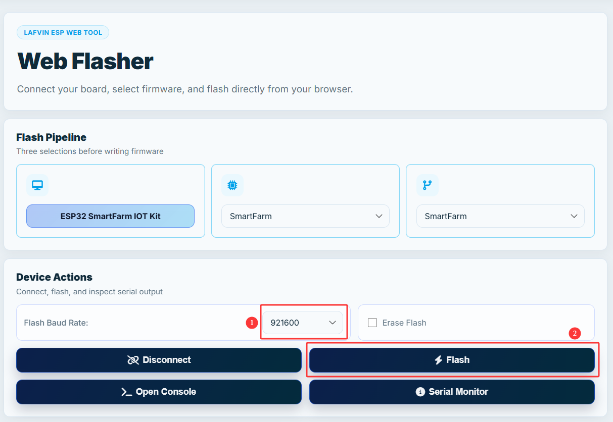

.. raw:: html

   

6. Select 921600 for Flash Baud Rate and click **flash** to start the burning process.

.. raw:: html

   

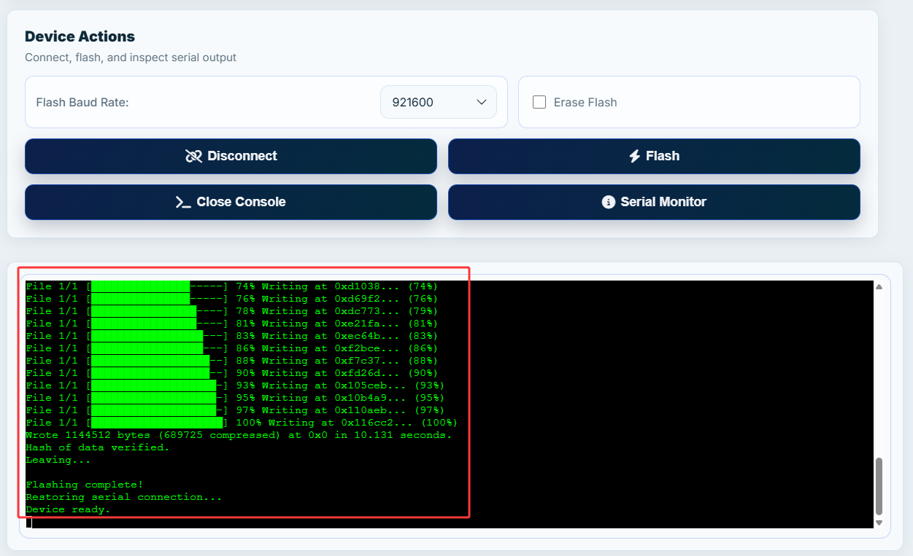

.. raw:: html

   

7. You can check the burning progress below.

8. After the programming is complete, press the **RST Button** on the ESP32 development board to start the program.

----