SmartFarm Function User Guide
=============================

**This kit integrates multiple interaction methods, enabling automatic control via sensors, remote monitoring and operation via a mobile app, and voice control.**

**These diverse interaction modes make learning and experiencing smartfarm more intuitive, convenient, and enriching.**

----

Automatic Control
-----------------

 - When the DHT11  sensor detects an increase in temperature, the fan will automatically turn on.
 - The light sensor detects a decrease in brightness, and the RGB lights will automatically turn on white lights for supplementary lighting.
 - When the brightness sensor detects a decrease in brightness and the human body sensor detects someone passing by, the buzzer will automatically sound an alarm.

----

Infrared Remote Control
-----------------------

.. raw:: html

   

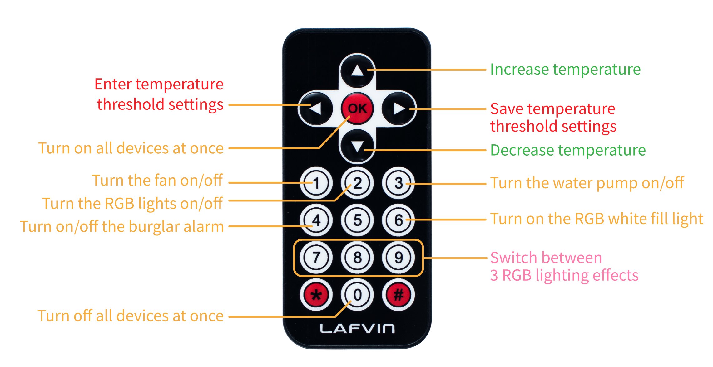

.. raw:: html

   

- The OK button can turn on the fan, water pump, and RGB lights with one click, while the 0 button can turn them off with one click.
- Press button 1 to turn on the fan, press button 2 to turn on the RGB light, press button 3 to turn on the water pump, press button 4 to turn on the alarm mode, press button 6 to turn on the RGB light supplement, and press buttons 7, 8, and 9 to switch between three RGB light effects.
- Press the left button to enter the temperature threshold setting of the temperature controlled fan. Set it by pressing the up and down buttons, and adjust it by 0.5 degrees Celsius each time. Press the left button again to confirm the setting.

----

.. raw:: html

   

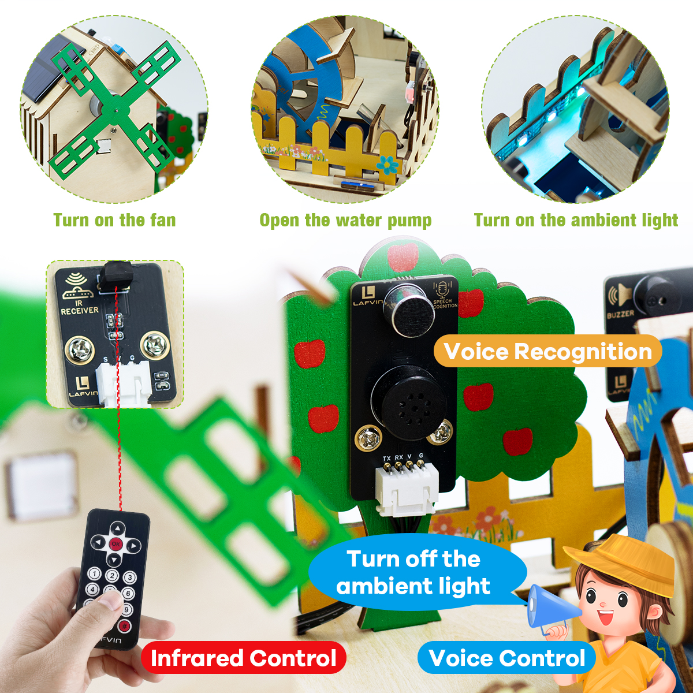

.. raw:: html

   

Speech Recognition Control
---------------------------

This kit supports voice recognition, allowing users to directly control LED lights, fans, doors and windows, and adjust the volume through voice commands.  

- Before using voice control, you need to wake up the device.The wake-up phrase is: **"Hi Lola."** When the device responds, **"Hi, I am Lola, how can I help you?"** , it has successfully woken up.You can now use the following voice commands to control the device：
- Open the water pump
- Shut down the water pump
- Turn on the fan
- Turn off the fan
- Turn on the ambient light
- Turn off the ambient light
- Volume up
- Lower the volume

----

.. note::

   - The system only recognizes the following preset commands. Voice content outside the range will not take effect.

----

App Control
-----------

.. raw:: html

   

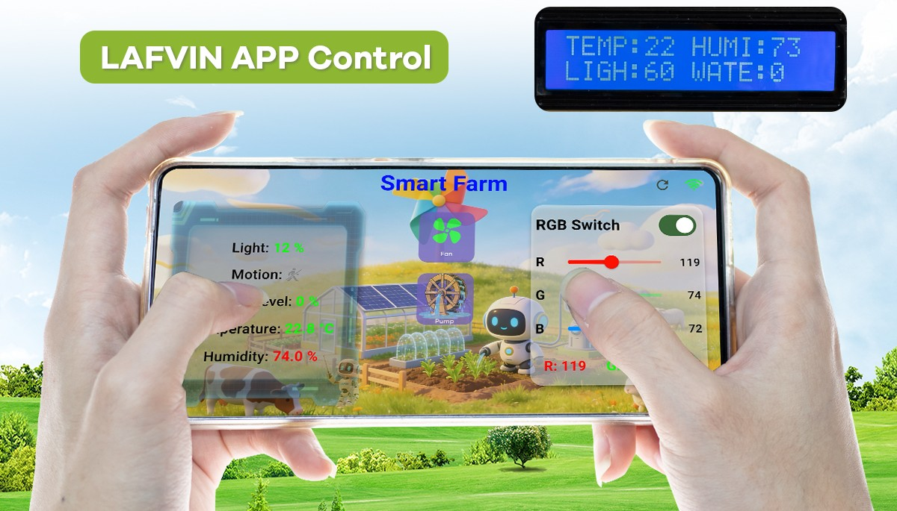

.. raw:: html

   

1. APP Download
~~~~~~~~~~~~~~~

- For Android system, click the link below to download the installation package, or scan the QR code below to download.
- iOS devices can download the app from the App Store. Search for “LAFVIN” to find and install it, or scan the QR code below to jump to the download page.

----

2. Network configuration
~~~~~~~~~~~~~~~~~~~~~~~~

- Before using the app to control it, the ESP32 development board must be connected to a Wi-Fi network. This is a necessary condition for enabling communication between the mobile phone and the development board.

2-1：After flashing the program, press the **RST button** on the development board. Then, open your phone's Wi-Fi list. You will find a new network named **Smart_Farm** （generated by the ESP32 development board）. Select and connect to it.

.. raw:: html

   

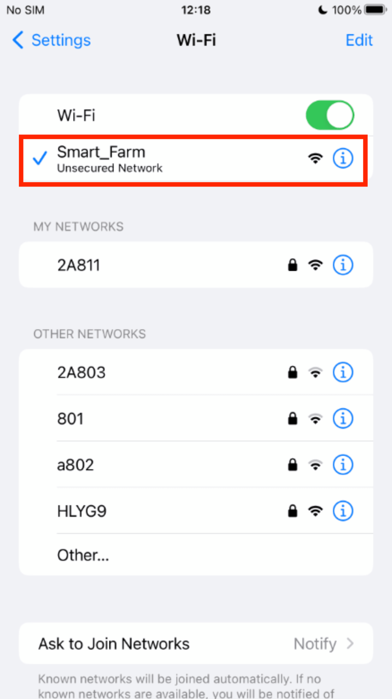

.. raw:: html

   

2-2：After a successful connection, open any browser and enter the IP address **192.168.4.1** in the address bar. You will be redirected to the network configuration page.

.. raw:: html

   

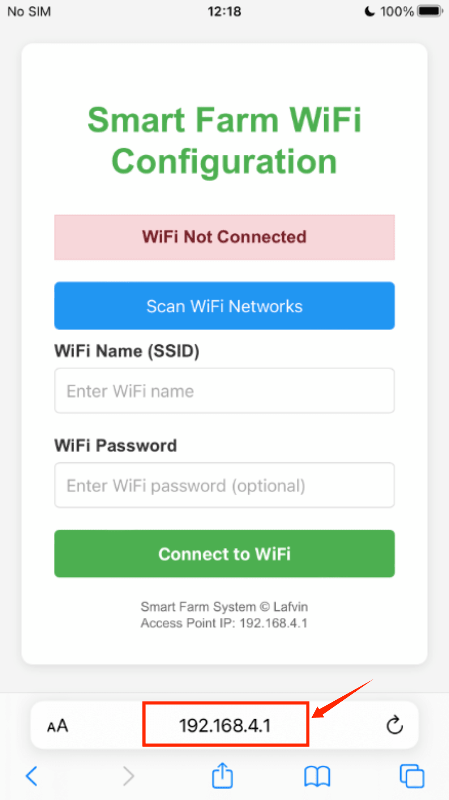

.. raw:: html

   

2-3：Click **Scan WiFi Network**, wait a few seconds and the surrounding WiFi information will appear. Select the WiFi network you want to connect to.

.. raw:: html

   

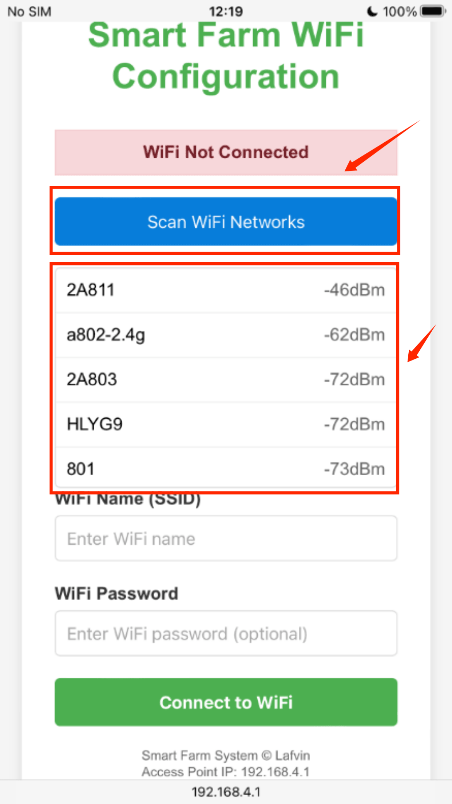

.. raw:: html

   

2-4：If the target Wi-Fi network is password protected, please enter the password as prompted; if there is no password, you can directly click **Connect to WiFi**. Once the connection is successful, the page will display the appropriate message.

.. raw:: html

   

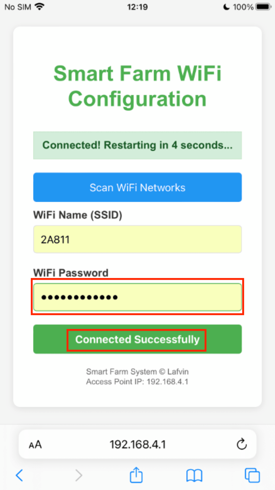

.. raw:: html

   

2-5：After successful network configuration, please connect the mobile phone used to operate the APP to the same Wi-Fi network to ensure that the mobile phone and the ESP32 development board are on the same local area network before proceeding with subsequent control.

2-6：To confirm network connectivity, please press the RST button on the ESP32 to restart the device after network configuration. Then observe the LCD1602 screen: it will first display the Wi-Fi name, and after a successful connection, it will display the device's local IP address. Please note this IP address, as it is crucial information for app connection.

.. raw:: html

   

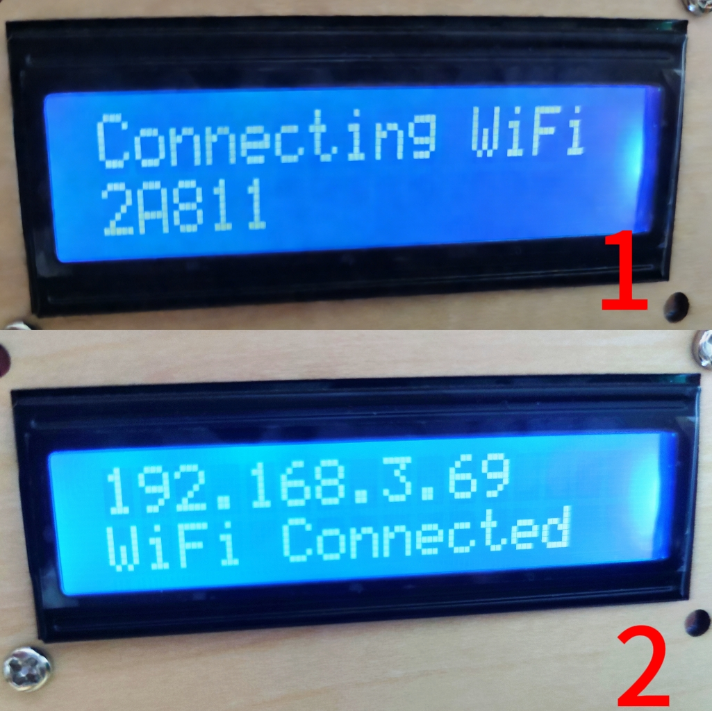

.. raw:: html

   

2-7：Open the downloaded app, and after entering the interface, click the WiFi icon in the upper right corner and enter the IP address that was just displayed on the LCD1602 screen.

2.8：Once the connection is successful, a notification will pop up on the screen, and you can then use the app to operate it.

.. note::
   
   **Troubleshooting Device Connectivity Issues**
   
 1. Place the device as close as possible to your Wi-Fi router to ensure a stable network connection.

 2. Ensure your mobile phone is connected to the same Wi-Fi network as the ESP32 device. This is essential for communication.

 3. Confirm the ESP32 development board is powered on and the LCD1602 screen displays the local IP address.

 4. Briefly press the RST button to restart the device and observe the screen transition from Wi-Fi name to IP address.

 5. You can try re-flashing the complete firmware to the ESP32 development board to rule out program errors.

----

3. APP Interface Operation Guide
~~~~~~~~~~~~~~~~~~~~~~~~~~~~~~~~~

The APP interface is shown in the image below.

.. raw:: html

   

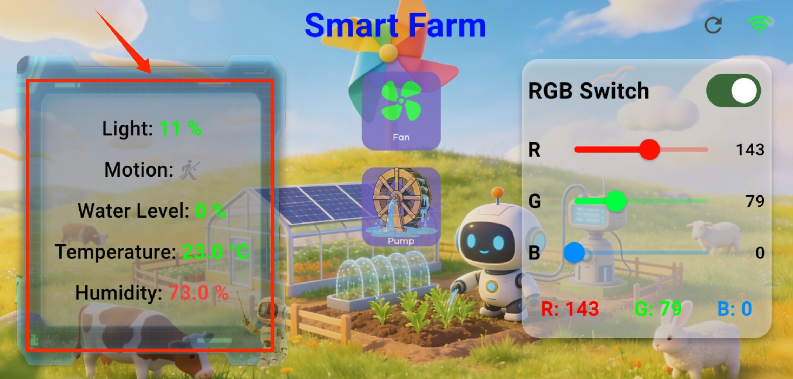

.. raw:: html

   

The left side displays environmental information, including real-time monitoring and display of temperature, humidity, brightness, water level, and human body alerts.

.. raw:: html

   

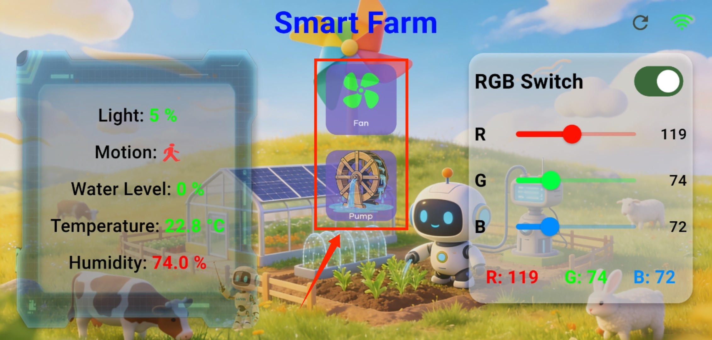

.. raw:: html

   

The control buttons in the middle can be used to turn the water pump and fan on and off.

.. raw:: html

   

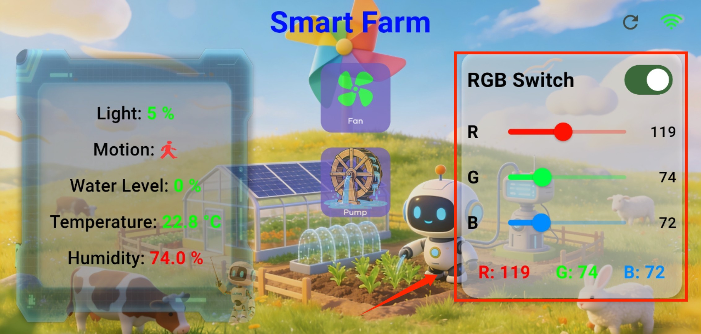

.. raw:: html

   

The right side is the RGB control area. Clicking the switch allows you to adjust the red, green, and blue colors of the RGB spectrum.

----
