The  Kit Course Learning
========================

 - This kit not only provides you with a complete course curriculum but also guides you through a step-by-step in-depth study of the fundamentals and applications of the Internet of Things. 
 - In this section, we'll individually introduce each component and functional module included in the kit, from basic sensors and actuators to communication modules, to help you systematically understand their functions and usage. 
 - By studying the working principles of these components, you'll not only master how to connect and control modules in real-world projects, but also gain a deeper understanding of how IoT systems achieve environmental perception, intelligent linkage, and remote operation. 
 - This will lay a solid foundation for your subsequent experiments, course design, and IoT project development, allowing you to better grasp the core knowledge of smart hardware and the Internet of Things.
 - Click this link to download all the example code provided with this kit. `Download sample code <https://www.dropbox.com/scl/fo/syf1zstu58f4xlcld2nss/ACJOi93PcIafo5yGabrprDA?rlkey=hoc2undykymrxac7z8nclpk9u&st=el86zaw9&dl=1>`_  

.. note::

 The following courses all come with sample code. You have two options for flashing the code:

 Option 1: If you choose to flash the code using the Arduino IDE, click here to jump to the Arduino IDE flashing tutorial. :ref:`Arduino IDE burning program`

 Option 2: If you choose to flash the code using Espressif's official flashing tool, click here to jump to the official flashing tool flashing tutorial. :ref:`Direct Burn Program`

----

Course 1：TEMP_HUMI
-------------------

Wiring Diagram
~~~~~~~~~~~~~~

 - DHT11 Sensor → ESP32 IO15

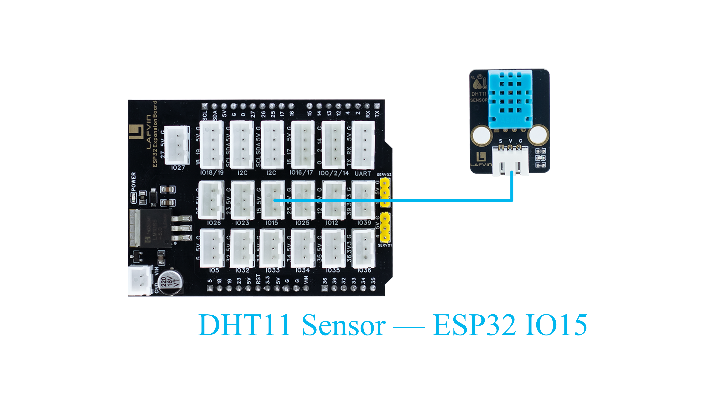

----

Sample Code
~~~~~~~~~~~

.. code-block:: cpp

 #include "DHT.h"

 // Define pin and sensor type
 #define DHTPIN 15         // DHT11 data pin connected to GPIO15 of ESP32
 #define DHTTYPE DHT11     

 DHT dht(DHTPIN, DHTTYPE); // Create DHT object

 void setup() {
  Serial.begin(115200);   // Initialize serial communication
  dht.begin();            // Initialize DHT11 sensor
  Serial.println("DHT11 Temperature & Humidity Sensor Test Started");
 }

 void loop() {
  delay(2000); // Read every two seconds

  float humidity = dht.readHumidity();     // Read humidity
  float temperature = dht.readTemperature(); // Read temperature (Celsius by default)

  // Check if read was successful
  if (isnan(humidity) || isnan(temperature)) {
    Serial.println("Failed to read from DHT11 sensor!");
    return;
  }

  // Output data to serial monitor
  Serial.print("Temperature: ");
  Serial.print(temperature);
  Serial.print(" °C  | Humidity: ");
  Serial.print(humidity);
  Serial.println(" %");
 }

----

Code Burning Options
~~~~~~~~~~~~~~~~~~~~

**You can directly copy the code provided above into the Arduino IDE for burning.**

1.Download the **1.TEMP_HUMI.ino** file from the provided resources, open it with the Arduino IDE and upload it to the ESP32 development board.

2.Download the **1.TEMP_HUMI.bin** firmware file from the provided resources and flash it to the ESP32 development board using the flash_download_tool.

----

Effect Display
~~~~~~~~~~~~~~

Open the serial port monitor and select 115200 from the baud rate drop-down menu.

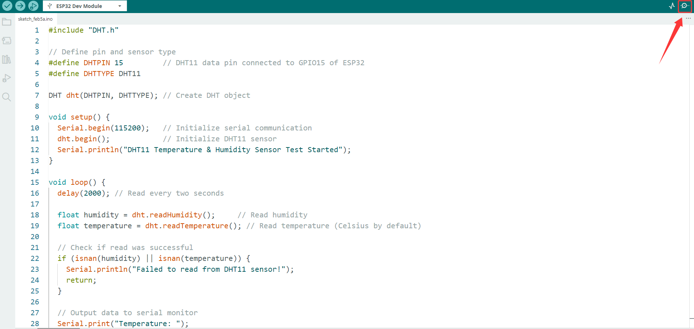

.. raw:: html

   

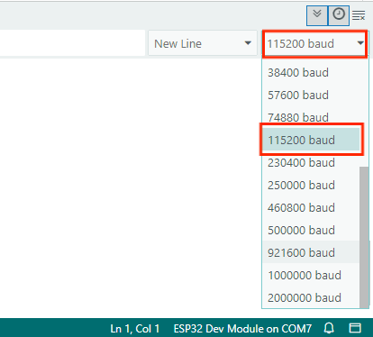

.. raw:: html

   

The serial monitor will output the current ambient temperature and humidity.

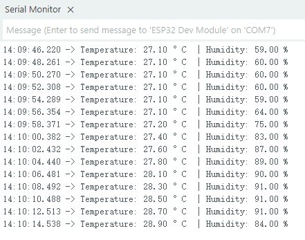

----

Course 2：Brightness Detection
------------------------------

Wiring Diagram
~~~~~~~~~~~~~~

 - Light Sensor → ESP32 IO34

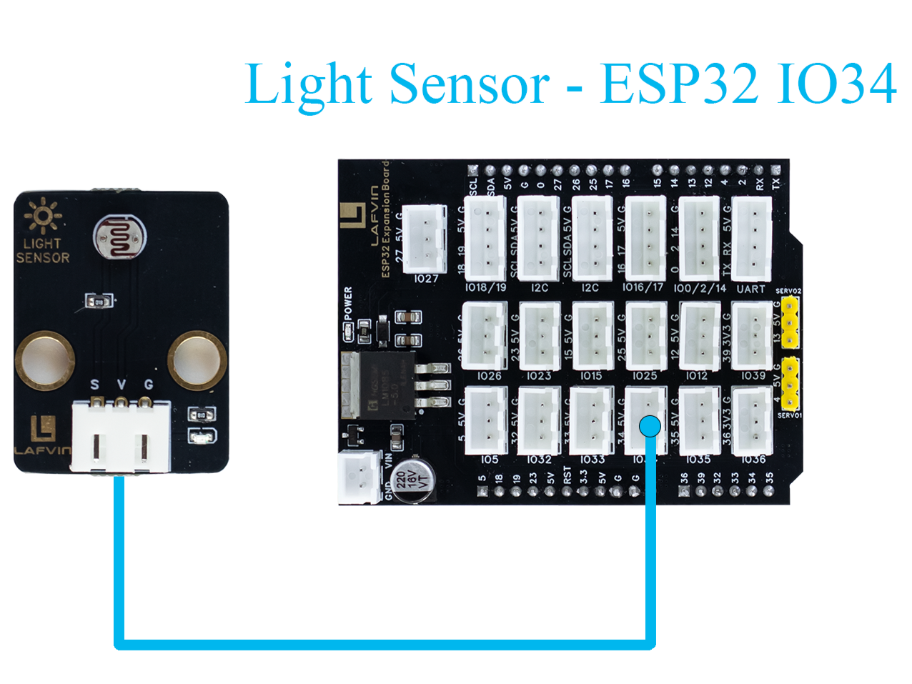

----

Sample Code
~~~~~~~~~~~

.. code-block:: cpp

   #include <Arduino.h>

   // Define sensor pin
   const int lightSensorPin = 34;  // S pin connected to GPIO34 (ADC input)

   void setup() {
       Serial.begin(115200);
       delay(1000);
       Serial.println("Light Sensor Test Started");
   }

   void loop() {
       int sensorValue = analogRead(lightSensorPin);
       float brightnessPercent = sensorValue * 100.0 / 4095.0;
       Serial.print("ADC Value: ");
       Serial.print(sensorValue);
       Serial.print("  |  Brightness: ");
       Serial.print(brightnessPercent);
       Serial.println("%");
       delay(3000);
   }

----

Code Burning Options
~~~~~~~~~~~~~~~~~~~~

**You can directly copy the code provided above into the Arduino IDE for burning.**

1.Download the **2.Brightness.ino** file from the provided resources, open it with the Arduino IDE and upload it to the ESP32 development board.

2.Download the **2.Brightness.bin** firmware file from the provided resources and flash it to the ESP32 development board using the flash_download_tool.

----

Effect Display
~~~~~~~~~~~~~~

Open the serial port monitor and set the baud rate to 115200 to continuously read the ambient light intensity data in the serial port.

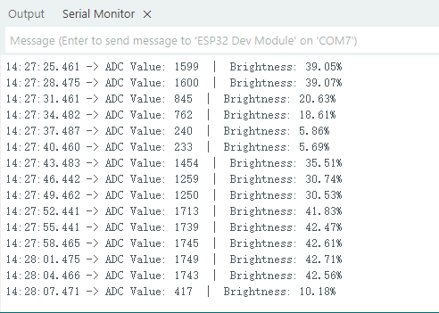

----

Course 3：Human Body Detection
------------------------------

Wiring Diagram
~~~~~~~~~~~~~~

 - PIR Sensor → ESP32 IO33

 - Light Sensor → ESP32 IO34

 - Buzzer Module → ESP32 IO26

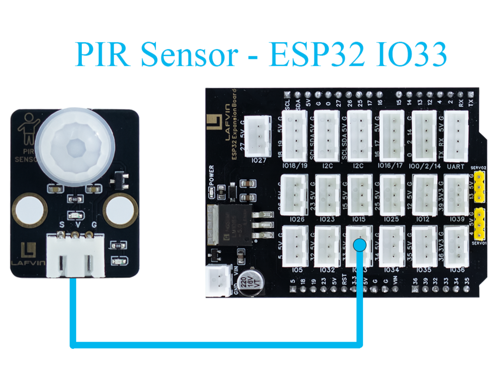

----

Sample Code
~~~~~~~~~~~

.. code-block:: cpp

   #include <Arduino.h>

   // Define PIR sensor pin
   const int pirPin = 33;  // Signal pin connected to GPIO33

   void setup() {
       // Initialize serial communication at 115200 baud
       Serial.begin(115200);
       delay(1000); // Give time for Serial Monitor to start

       // Set PIR pin as input
       pinMode(pirPin, INPUT);

       Serial.println("PIR Sensor Test Started");
   }

   void loop() {
       // Read PIR sensor digital value
       int motionDetected = digitalRead(pirPin);

       if (motionDetected == HIGH) {
           // Motion detected
           Serial.println("Motion Detected!");
       } else {
           // No motion
           Serial.println("No Motion");
       }

       // Wait 3000 milliseconds before next reading
       delay(3000);
   }

----

Code Burning Options
~~~~~~~~~~~~~~~~~~~~

**You can directly copy the code provided above into the Arduino IDE for burning.**

1.Download the **3.Human_Body.ino** file from the provided resources, open it with the Arduino IDE and upload it to the ESP32 development board.

2.Download the **3.Human_Body.bin** firmware file from the provided resources and flash it to the ESP32 development board using the flash_download_tool.

----

Effect Display
~~~~~~~~~~~~~~

Open the serial port monitor and set the baud rate to 115200. The serial port will then display whether a human body has been detected.

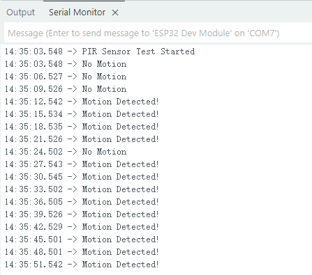

----

Course 4：Burglar Alarm
-----------------------

Wiring Diagram
~~~~~~~~~~~~~~

 - PIR Sensor → ESP32 IO33

 - Light Sensor → ESP32 IO33

 - Buzzer Module → ESP32 IO33

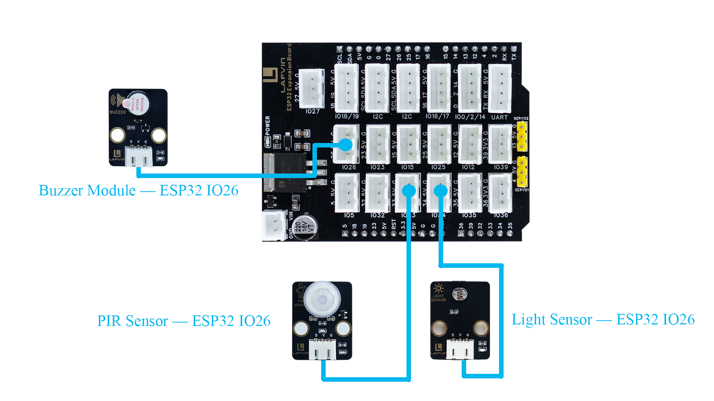

----

Sample Code
~~~~~~~~~~~

.. code-block:: cpp

  // Pin definitions
  const int BUZZER_PIN = 26;
  const int PIR_PIN = 33;
  const int LIGHT_PIN = 34;

  // Constants
  const int LIGHT_THRESHOLD = 10;
  const unsigned long ALARM_DURATION = 5000;

  // Variables
  bool alarmActive = false;
  unsigned long alarmStartTime = 0;

  void setup() {
    Serial.begin(115200);
    Serial.println("Night Security Alarm System Started");
    Serial.println("===================================");
    
    pinMode(BUZZER_PIN, OUTPUT);
    pinMode(PIR_PIN, INPUT);
    pinMode(LIGHT_PIN, INPUT);
    
    digitalWrite(BUZZER_PIN, LOW);
    
    Serial.println("System Ready - Monitoring...");
  }

  void loop() {
    int lightValue = readLightLevel();
    bool motionDetected = readMotion();
    
    Serial.print("Light Level: ");
    Serial.print(lightValue);
    Serial.print(" | Motion: ");
    Serial.println(motionDetected ? "DETECTED" : "No");
    
    if (lightValue < LIGHT_THRESHOLD && motionDetected && !alarmActive) {
      triggerAlarm();
      Serial.println("ALARM TRIGGERED! Low light + motion detected!");
    }
    
    if (alarmActive) {
      handleActiveAlarm();
    }
    
    delay(500);
  }

  // Read and normalize light level (0-100)
  int readLightLevel() {
    int rawValue = analogRead(LIGHT_PIN);
    int normalizedValue = map(rawValue, 0, 4095, 0, 100);
    normalizedValue = constrain(normalizedValue, 0, 100);
    return normalizedValue;
  }

  // Read PIR motion sensor
  bool readMotion() {
    return digitalRead(PIR_PIN) == HIGH;
  }

  // Trigger alarm
  void triggerAlarm() {
    alarmActive = true;
    alarmStartTime = millis();
    digitalWrite(BUZZER_PIN, HIGH);
    Serial.println("=== ALARM ACTIVATED ===");
  }

  // Handle active alarm
  void handleActiveAlarm() {
    unsigned long currentTime = millis();
    if (currentTime - alarmStartTime >= ALARM_DURATION) {
      stopAlarm();
      Serial.println("Alarm stopped after duration");
    }
  }

  // Stop alarm
  void stopAlarm() {
    alarmActive = false;
    digitalWrite(BUZZER_PIN, LOW);
    Serial.println("=== ALARM DEACTIVATED ===");
  }

----

Code Burning Options
~~~~~~~~~~~~~~~~~~~~

**You can directly copy the code provided above into the Arduino IDE for burning.**

1.Download the **4.Burglar_Alarm.ino** file from the provided resources, open it with the Arduino IDE and upload it to the ESP32 development board.

2.Download the **4.Burglar_Alarm.bin** firmware file from the provided resources and flash it to the ESP32 development board using the flash_download_tool.

----

Effect Display
~~~~~~~~~~~~~~

When the ambient light drops to 10% and someone passes by, a buzzer alarm sounds and relevant information is displayed on the serial monitor.

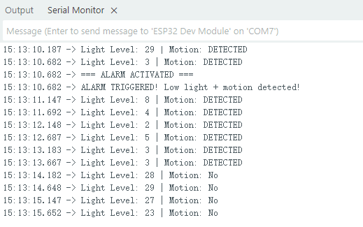

----

Course 5：Infrared Remote
-------------------------

Wiring Diagram
~~~~~~~~~~~~~~

 - IR Receiver Module → ESP32 IO15

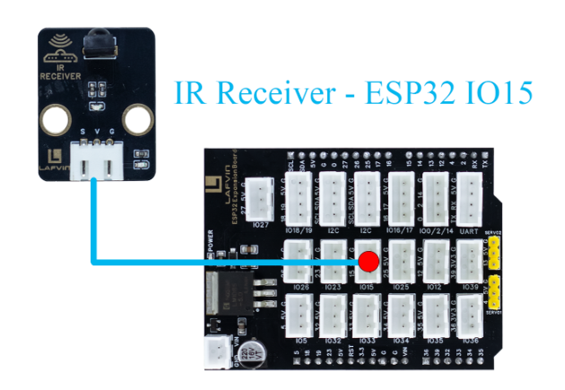

----

Sample Code
~~~~~~~~~~~

.. code-block:: cpp
    
  #include <IRremote.h>

  // Hardware Definitions
  #define IR_RECEIVE_PIN 15
  String lastKey = "";      // Save last key press
  String currentKey = "";

  // Key Mapping
  String keyMap(uint32_t code) {
    switch(code) {
      case 0x16: return "1";
      case 0x19: return "2";
      case 0x0d: return "3";
      case 0x0c: return "4";
      case 0x18: return "5";
      case 0x5e: return "6";
      case 0x08: return "7";
      case 0x1c: return "8";
      case 0x5A: return "9";
      case 0x52: return "0";
      case 0x42: return "*";
      case 0x4A: return "#";
      case 0x46: return "UP";
      case 0x15: return "DOWN";
      case 0x40: return "OK";
      case 0x44: return "LEFT";
      case 0x43: return "RIGHT";
      default: return "";
    }
  }

  // Setup
  void setup() {
    Serial.begin(115200);
    Serial.println("ESP32 IR Remote Serial Display");
    Serial.println("==============================");

    // IR Receiver initialization
    IrReceiver.begin(IR_RECEIVE_PIN, ENABLE_LED_FEEDBACK);
    Serial.println("IR Receiver initialized");
    Serial.println("Waiting for IR signals...");
    Serial.println();
  }

  // Main Loop
  void loop() {
    // Detect IR signals
    if (IrReceiver.decode()) {
      uint32_t code = IrReceiver.decodedIRData.command; // Get command code
      String key = keyMap(code);

      if (key != "" && key != lastKey) {  // Only update for new keys
        currentKey = key;
        lastKey = key;
        Serial.print("IR Key Pressed: ");
        Serial.println(currentKey);
      }

      IrReceiver.resume();  // Prepare for next reception
    }
  }

----

Code Burning Options
~~~~~~~~~~~~~~~~~~~~

**You can directly copy the code provided above into the Arduino IDE for burning.**

1.Download the **5.Infrared_Remote.ino** file from the provided resources, open it with the Arduino IDE and upload it to the ESP32 development board.

2.Download the **5.Infrared_Remote.bin** firmware file from the provided resources and flash it to the ESP32 development board using the flash_download_tool.

----

Effect Display
~~~~~~~~~~~~~~

Pressing any button on the remote control will display the corresponding button in the serial port monitor.

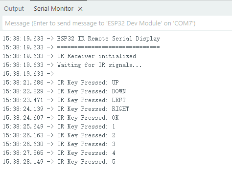

----

Course 6：Remote Control Fan
----------------------------

Wiring Diagram
~~~~~~~~~~~~~~

 - IR Receiver Module → ESP32 IO15
 - Motor Fan Module → ESP32 IO27

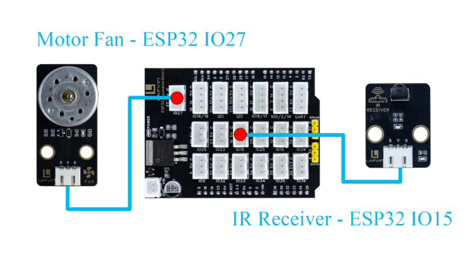

----

Sample Code
~~~~~~~~~~~

.. code-block:: cpp
    
  #include <IRremote.h>

  // Pin Definitions
  #define IR_RECEIVE_PIN 15
  #define FAN_PIN 27

  bool fanOn = false;
  int fanLevel = 0;
  String lastKey = "";
  unsigned long lastKeyTime = 0; // Debounce timer

  // Key Mapping
  String keyMap(uint32_t code) {
    switch(code) {
      case 0x16: return "1";
      case 0x19: return "2";
      case 0x0d: return "3";
      case 0x40: return "OK";
      default: return "";
    }
  }

  // Fan Control Function
  void setFanLevel(int level, bool on = true){
    fanOn = on;
    fanLevel = (fanOn) ? level : 0;
    int duty = 0;
    if(fanOn){
      switch(fanLevel){
        case 1: duty = 85; break;
        case 2: duty = 170; break;
        case 3: duty = 255; break;
        default: duty = 0;
      }
    }
    analogWrite(FAN_PIN, duty);
  }

  // Setup
  void setup(){
    Serial.begin(115200);
    Serial.println("ESP32 Fan Control via IR");
    Serial.println("========================");
    Serial.println("Key Functions:");
    Serial.println("  OK  - Toggle power");
    Serial.println("  1   - Level 1");
    Serial.println("  2   - Level 2");
    Serial.println("  3   - Level 3");
    Serial.println("========================");

    pinMode(FAN_PIN, OUTPUT);
    setFanLevel(0, false); // Initially turn off fan

    // IR receiver
    IrReceiver.begin(IR_RECEIVE_PIN, ENABLE_LED_FEEDBACK);
    Serial.println("IR Receiver initialized");
    Serial.println("Ready for IR commands...");
    Serial.println();
  }

  // Main Loop
  void loop(){
    if(IrReceiver.decode()){
      uint32_t code = IrReceiver.decodedIRData.command;
      String key = keyMap(code);

      if(key != "" && (key != lastKey || millis() - lastKeyTime > 300)){
        lastKey = key;
        lastKeyTime = millis();

        if(key == "OK") setFanLevel((fanLevel > 0) ? fanLevel : 1, !fanOn);
        else if(fanOn){
          if(key == "1") setFanLevel(1);
          else if(key == "2") setFanLevel(2);
          else if(key == "3") setFanLevel(3);
        }

        Serial.print("IR Key: ");
        Serial.print(key);
        Serial.print(" => Fan Level: ");
        Serial.print(fanLevel);
        Serial.print(" | Fan State: ");
        Serial.println(fanOn ? "ON" : "OFF");
      }

      IrReceiver.resume();
    }
  }

----

Code Burning Options
~~~~~~~~~~~~~~~~~~~~

**You can directly copy the code provided above into the Arduino IDE for burning.**

1.Download the **6.FAN.ino** file from the provided resources, open it with the Arduino IDE and upload it to the ESP32 development board.

2.Download the **6.FAN.bin** firmware file from the provided resources and flash it to the ESP32 development board using the flash_download_tool.

----

Effect Display
~~~~~~~~~~~~~~

Press the "OK" button on the infrared remote control to start the fan. The default speed is 1. Press the button to increase the speed to 2 or 3, and the airflow will gradually increase. Press the "OK" button again to turn off the fan.

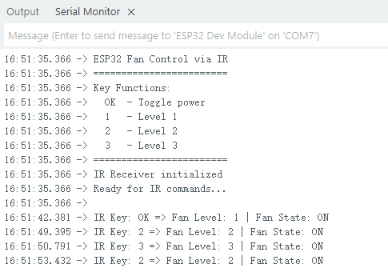

----

Course 7：Vibrant RGB
---------------------

Wiring Diagram
~~~~~~~~~~~~~~

 - RGB light strip → ESP32 IO5

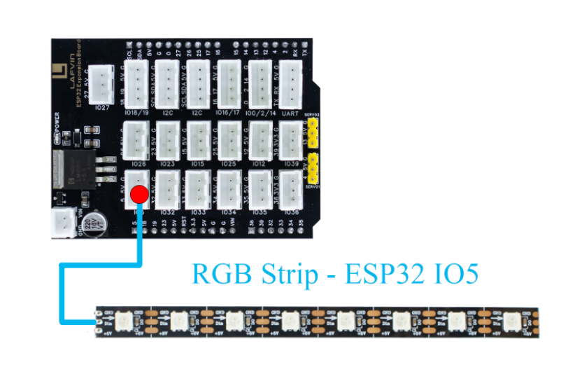

----

Sample Code
~~~~~~~~~~~

.. code-block:: cpp
    
  #include <IRremote.h>

  #include <Adafruit_NeoPixel.h>

  // LED Configuration
  #define LED_PIN     5
  #define LED_COUNT   8
  #define BRIGHTNESS  150  // Higher default brightness

  Adafruit_NeoPixel strip(LED_COUNT, LED_PIN, NEO_GRB + NEO_KHZ800);

  // Mode Variables
  int currentMode = 1;  // Current mode (1-3)
  unsigned long previousMillis = 0;
  int hue = 0;
  int chasePos = 0;
  int scannerPos = 0;
  int pulseValue = 0;
  bool pulseUp = true;

  // Predefined Color Palette
  uint32_t colorPalette[] = {
    strip.Color(255, 0, 0),       // Red
    strip.Color(0, 255, 0),       // Green
    strip.Color(0, 0, 255),       // Blue
    strip.Color(255, 255, 0),     // Yellow
    strip.Color(255, 0, 255),     // Purple
    strip.Color(0, 255, 255),     // Cyan
    strip.Color(255, 165, 0),     // Orange
    strip.Color(255, 20, 147),    // Deep Pink
    strip.Color(138, 43, 226),    // Blue Violet
    strip.Color(50, 205, 50),     // Lime Green
    strip.Color(255, 215, 0),     // Gold
    strip.Color(220, 20, 60),     // Crimson
    strip.Color(30, 144, 255),    // Dodger Blue
    strip.Color(255, 105, 180),   // Hot Pink
    strip.Color(0, 255, 127),     // Spring Green
    strip.Color(148, 0, 211)      // Dark Violet
  };
  int colorCount = sizeof(colorPalette) / sizeof(colorPalette[0]);

  void setup() {
    Serial.begin(115200);
    Serial.println("\n============= RGB LED Strip Controller =============");
    Serial.println("Mode 1: Rainbow Chase");
    Serial.println("Mode 2: Color Marquee");
    Serial.println("Mode 3: Cosmic Pulse");
    Serial.println("====================================================");
    Serial.println("Send 1, 2, or 3 via serial to change modes");
    Serial.println("====================================================");
    
    strip.begin();
    strip.setBrightness(BRIGHTNESS);
    strip.clear();
    strip.show();
    
    Serial.print("Current Mode: ");
    Serial.println(currentMode);
  }

  void loop() {
    unsigned long currentMillis = millis();
    
    // Handle serial commands
    if (Serial.available() > 0) {
      handleSerialCommand();
    }
    
    // Execute effects based on current mode
    switch(currentMode) {
      case 1:
        if (currentMillis - previousMillis >= 50) {
          rainbowChase();
          previousMillis = currentMillis;
        }
        break;
        
      case 2:
        if (currentMillis - previousMillis >= 100) {
          colorMarquee();
          previousMillis = currentMillis;
        }
        break;
        
      case 3:
        if (currentMillis - previousMillis >= 30) {
          cosmicPulse();
          previousMillis = currentMillis;
        }
        break;
    }
  }

  // Serial Command Handler
  void handleSerialCommand() {
    char command = Serial.read();
    
    if (command == '1' || command == '2' || command == '3') {
      currentMode = command - '0';
      strip.clear();
      strip.show();
      Serial.print("Switched to Mode ");
      Serial.println(currentMode);
    }
  }

  // Mode 1: Rainbow Chase Effect
  void rainbowChase() {
    strip.clear();
    
    // Create rainbow chase effect
    for(int i = 0; i < strip.numPixels(); i++) {
      int pixelHue = (hue + i * 40 + chasePos * 20) % 65536;
      uint32_t color = strip.gamma32(strip.ColorHSV(pixelHue, 255, 255));
      
      strip.setPixelColor(i, color);
      
      // Add trailing effect
      for(int j = 1; j <= 2; j++) {
        int trailPos = (i - j + strip.numPixels()) % strip.numPixels();
        int trailHue = (pixelHue - j * 2000 + 65536) % 65536;
        uint32_t trailColor = strip.gamma32(strip.ColorHSV(trailHue, 255, 200 - j * 50));
        strip.setPixelColor(trailPos, trailColor);
      }
    }
    
    strip.show();
    
    chasePos = (chasePos + 1) % strip.numPixels();
    hue = (hue + 500) % 65536;
  }

  // Mode 2: Color Marquee Effect
  void colorMarquee() {
    static int colorIndex = 0;
    
    for(int i = 0; i < strip.numPixels(); i++) {
      int idx = (colorIndex + i * 2 + chasePos) % colorCount;
      strip.setPixelColor(i, colorPalette[idx]);
    }
    
    strip.show();
    
    chasePos = (chasePos + 1) % strip.numPixels();
    colorIndex = (colorIndex + 1) % colorCount;
  }

  // Mode 3: Cosmic Pulse Effect
  void cosmicPulse() {
    // Update pulse value
    if (pulseUp) {
      pulseValue += 4;
      if (pulseValue >= 255) {
        pulseValue = 255;
        pulseUp = false;
      }
    } else {
      pulseValue -= 2;
      if (pulseValue <= 30) {
        pulseValue = 30;
        pulseUp = true;
      }
    }
    
    // Main pulse color (blue-purple tones)
    uint8_t mainR = (uint8_t)(pulseValue * 0.3 + 50);
    uint8_t mainG = (uint8_t)(pulseValue * 0.1 + 20);
    uint8_t mainB = (uint8_t)(pulseValue * 0.8 + 50);
    
    // Create pulse wave effect
    for(int i = 0; i < strip.numPixels(); i++) {
      float phase = (i + scannerPos) * 0.5;
      float wave = sin(pulseValue * 0.02 + phase) * 0.5 + 0.5;
      
      uint8_t r = (uint8_t)(mainR * wave + random(0, 10));
      uint8_t g = (uint8_t)(mainG * wave + random(0, 5));
      uint8_t b = (uint8_t)(mainB * (0.7 + 0.3 * sin(pulseValue * 0.03 + i * 0.3)) + random(0, 15));
      
      // Add star twinkle effect
      if (random(0, 1000) < 5) {
        r = min(255, (int)r + 100);
        g = min(255, (int)g + 100);
        b = min(255, (int)b + 100);
      }
      
      strip.setPixelColor(i, strip.Color(r, g, b));
    }
    
    // Add scanning highlight
    int highlight = scannerPos % strip.numPixels();
    strip.setPixelColor(highlight, strip.Color(200, 200, 255));
    
    strip.show();
    
    scannerPos = (scannerPos + 1) % (strip.numPixels() * 2);
  }
  
----

Code Burning Options
~~~~~~~~~~~~~~~~~~~~

**You can directly copy the code provided above into the Arduino IDE for burning.**

1.Download the **7.RGB.ino** file from the provided resources, open it with the Arduino IDE and upload it to the ESP32 development board.

2.Download the **7.RGB.bin** firmware file from the provided resources and flash it to the ESP32 development board using the flash_download_tool.

----

Effect Display
~~~~~~~~~~~~~~

RGB displays a variety of lighting effects, which can be switched by sending 1, 2, or 3 through the serial port.

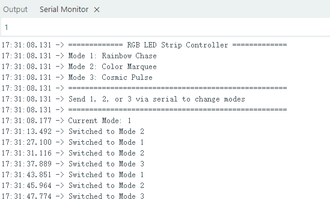

----

Course 8：Environmental Monitor
----------------------------------

Wiring Diagram
~~~~~~~~~~~~~~

 - DHT11 Sensor → ESP32 IO15

 - Light Sensor → ESP32 IO34

 - waterlevel Sensor → ESP32 IO36

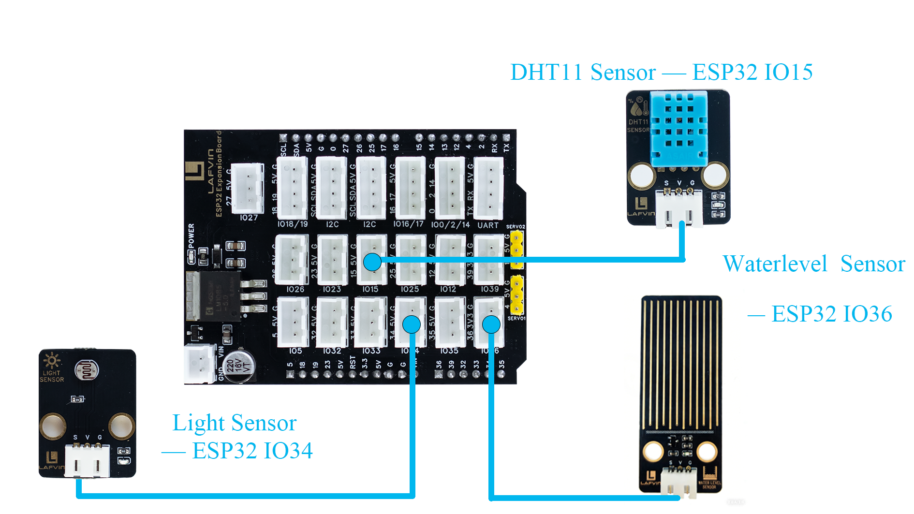

----

Sample Code
~~~~~~~~~~~

.. code-block:: cpp
    
  #include <Wire.h>
  #include <LiquidCrystal_I2C.h>
  #include <DHT.h>

  // Pin Definitions
  #define DHTPIN 15
  #define LIGHT_PIN 34
  #define WATER_PIN 36
  #define DHTTYPE DHT11

  // Initialize LCD (address 0x27, 16 columns, 2 rows)
  LiquidCrystal_I2C lcd(0x27, 16, 2);

  // Initialize DHT sensor
  DHT dht(DHTPIN, DHTTYPE);

  void setup() {
    // Initialize LCD
    lcd.init();
    lcd.backlight();
    
    // Initialize DHT sensor
    dht.begin();
    
    // Set analog input pins
    pinMode(LIGHT_PIN, INPUT);
    pinMode(WATER_PIN, INPUT);
    
    // Display initial message
    lcd.setCursor(0, 0);
    lcd.print("System Starting");
    lcd.setCursor(0, 1);
    lcd.print("Please Wait...");
    delay(2000);
    lcd.clear();
  }

  void loop() {
    // Read sensor data
    float temperature = dht.readTemperature();
    float humidity = dht.readHumidity();
    int lightLevel = readLightLevel();
    int waterLevel = readWaterLevel();
    
    // Check if temperature and humidity readings are valid
    if (isnan(temperature) || isnan(humidity)) {
      // Display error message if sensor fails
      lcd.clear();
      lcd.setCursor(0, 0);
      lcd.print("Sensor Error");
      delay(2000);
      return;
    }
    
    // Update LCD display
    updateDisplay(temperature, humidity, lightLevel, waterLevel);
    
    delay(2000); // Update every 2 seconds
  }

  // Read and normalize light level (0-100)
  int readLightLevel() {
    int rawValue = analogRead(LIGHT_PIN);
    int normalizedValue = map(rawValue, 0, 4095, 0, 100);
    normalizedValue = constrain(normalizedValue, 0, 100);
    return normalizedValue;
  }

  // Read and normalize water level (0-100)
  int readWaterLevel() {
    int rawValue = analogRead(WATER_PIN);
    int normalizedValue = map(rawValue, 0, 4095, 0, 100);
    normalizedValue = constrain(normalizedValue, 0, 100);
    return normalizedValue;
  }

  // Update LCD display
  void updateDisplay(float temp, float humi, int light, int water) {
    lcd.clear();
    
    // First line: Temperature and Humidity
    lcd.setCursor(0, 0);
    lcd.print("TEMP:");
    if (temp < 10) lcd.print("0");
    lcd.print((int)temp);
    lcd.print(" HUMI:");
    if (humi < 10) lcd.print("0");
    lcd.print((int)humi);
    
    // Second line: Light and Water level
    lcd.setCursor(0, 1);
    lcd.print("LIGH:");
    if (light < 10) lcd.print("0");
    lcd.print(light);
    lcd.print(" WATE:");
    if (water < 10) lcd.print("0");
    lcd.print(water);
  }
  
----

Code Burning Options
~~~~~~~~~~~~~~~~~~~~

**You can directly copy the code provided above into the Arduino IDE for burning.**

1.Download the **8.Environmental_Monitor.ino** file from the provided resources, open it with the Arduino IDE and upload it to the ESP32 development board.

2.Download the **8.Environmental_Monitor.bin** firmware file from the provided resources and flash it to the ESP32 development board using the flash_download_tool.

----

Effect Display
~~~~~~~~~~~~~~

The LCD1602 screen will display real-time information on monitored temperature, humidity, brightness, and water level.

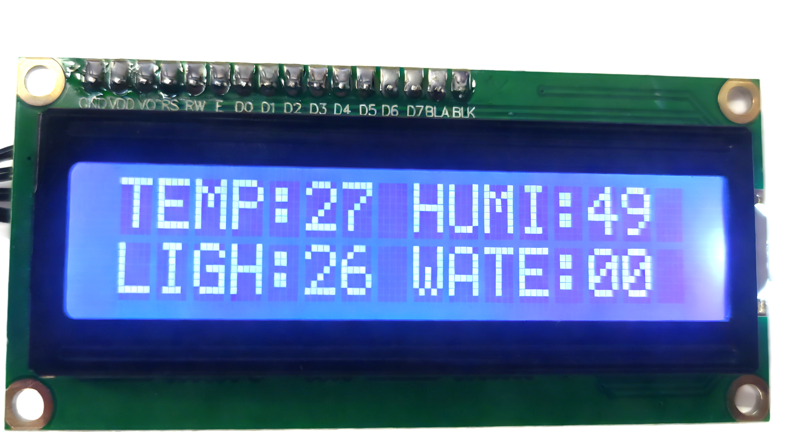

----

Course 9：Voice Controlled Fan
------------------------------

Wiring Diagram
~~~~~~~~~~~~~~

 - Speech Recognition Module → ESP32 IO16/17

 - Motor Fan Module → ESP32 IO27

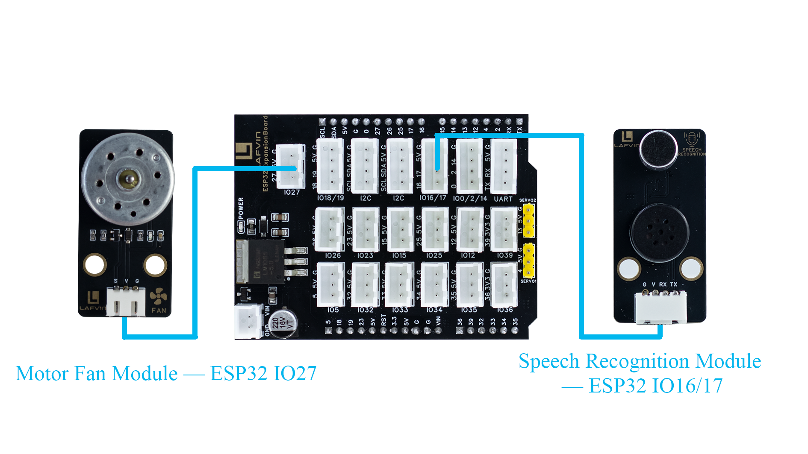

----

Sample Code
~~~~~~~~~~~

.. code-block:: cpp

  #include <Arduino.h>

  // FAN configuration
  #define FAN_PIN 27

  // Voice recognition
  #define VOICE_RX_PIN 16
  #define VOICE_TX_PIN 17
  #define VOICE_HEADER 0xAA          // Packet header
  #define VOICE_FOOTER 0xBB          // Packet footer
  #define VOICE_PACKET_LENGTH 3      // Packet length
  #define VOICE_KEY_FAN_ON 0x07      // Fan on command
  #define VOICE_KEY_FAN_OFF 0x08     // Fan off command

  HardwareSerial VoiceSerial(2);

  // Voice protocol parsing variables
  uint8_t voiceBuffer[VOICE_PACKET_LENGTH];
  int voiceBufferIndex = 0;
  bool voiceReceiving = false;
  unsigned long lastVoiceByteTime = 0;
  const unsigned long VOICE_TIMEOUT = 100; // Byte timeout in ms

  void setFanValue(int val) {
    digitalWrite(FAN_PIN, val);
  }

  int getFanValue() {
    return digitalRead(FAN_PIN);
  }

  // Validate command
  bool isValidVoiceCommand(uint8_t command) {
    return (command == VOICE_KEY_FAN_ON || command == VOICE_KEY_FAN_OFF);
  }

  // Process voice command
  void processVoiceCommand(uint8_t keyword) {
    if (keyword == VOICE_KEY_FAN_ON) {
      setFanValue(HIGH);
      Serial.println("Voice Command: FAN ON");
    } else if (keyword == VOICE_KEY_FAN_OFF) {
      setFanValue(LOW);
      Serial.println("Voice Command: FAN OFF");
    }
  }

  // Voice protocol parser
  void voiceSerialLoop() {
    // Check timeout
    if (voiceReceiving && millis() - lastVoiceByteTime > VOICE_TIMEOUT) {
      voiceBufferIndex = 0;
      voiceReceiving = false;
    }
    
    while (VoiceSerial.available() > 0) {
      uint8_t data = VoiceSerial.read();
      lastVoiceByteTime = millis();
      
      if (!voiceReceiving) {
        if (data == VOICE_HEADER) {
          voiceReceiving = true;
          voiceBufferIndex = 0;
          voiceBuffer[voiceBufferIndex++] = data;
        }
        continue;
      }
      
      if (voiceBufferIndex < VOICE_PACKET_LENGTH) {
        voiceBuffer[voiceBufferIndex++] = data;
        
        if (voiceBufferIndex == VOICE_PACKET_LENGTH) {
          if (voiceBuffer[0] == VOICE_HEADER && voiceBuffer[2] == VOICE_FOOTER) {
            uint8_t keyword = voiceBuffer[1];
            if (isValidVoiceCommand(keyword)) {
              processVoiceCommand(keyword);
            } else {
              Serial.print("Invalid command: 0x");
              Serial.println(keyword, HEX);
            }
          }
          voiceReceiving = false;
          voiceBufferIndex = 0;
        }
      } else {
        voiceReceiving = false;
        voiceBufferIndex = 0;
      }
    }
  }

  void setup() {
    Serial.begin(115200);
    VoiceSerial.begin(115200, SERIAL_8N1, VOICE_TX_PIN, VOICE_RX_PIN);
    pinMode(FAN_PIN, OUTPUT);
    setFanValue(LOW);  // 
    Serial.println("Voice-controlled FAN system started");
  }

  void loop() {
    voiceSerialLoop();  // Handle voice commands
  }

----

Code Burning Options
~~~~~~~~~~~~~~~~~~~~

**You can directly copy the code provided above into the Arduino IDE for burning.**

1.Download the **9.Voice_Fan.ino** file from the provided resources, open it with the Arduino IDE and upload it to the ESP32 development board.

2.Download the **9.Voice_Fan.bin** firmware file from the provided resources and flash it to the ESP32 development board using the flash_download_tool.

----

Effect Display
~~~~~~~~~~~~~~

Say **"Hi Lola"** to the voice module to wake it up, then use the command **"turn on the fan"** to turn the fan on or **"turn off the fan"** to turn it off.

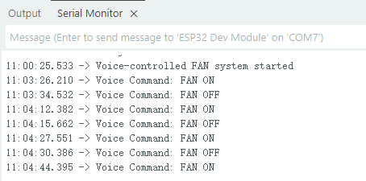

----

Course 10：Automatic Watering
-----------------------------

Wiring Diagram
~~~~~~~~~~~~~~

 - Water Level Sensor → ESP32 IO36

 - Relay Module → ESP32 IO23

 - Water Pump → Relay Module V+ V-

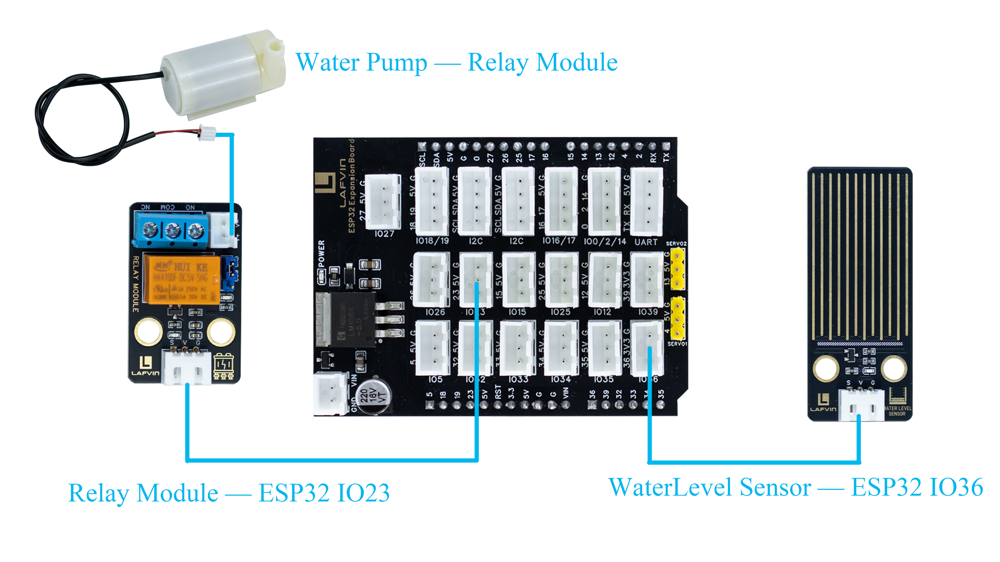

----

Sample Code
~~~~~~~~~~~

.. code-block:: cpp

  const int WATER_SENSOR_PIN = 36;  // Water level sensor
  const int RELAY_PIN = 23;         // Relay module control pin
  
  // Constants
  const int LOW_WATER_THRESHOLD = 10;  // Start pumping below this level
  const int HIGH_WATER_THRESHOLD = 70; // Stop pumping above this level
  const unsigned long CHECK_INTERVAL = 1000;  // Check interval (ms)
  
  // Variables
  int waterLevel = 0;
  bool pumpRunning = false;
  unsigned long lastCheckTime = 0;
  
  void setup() {
    // Initialize serial monitor for debugging
    Serial.begin(115200);
    Serial.println("Water Pump Control System");
    Serial.println("==========================");
    Serial.println("Water Level Range: 0-100%");
    Serial.println("Pump ON when level < 10%");
    Serial.println("Pump OFF when level > 70%");
    Serial.println("Relay: HIGH level activates");
    Serial.println("==========================");
    
    // Initialize pins
    pinMode(RELAY_PIN, OUTPUT);
    digitalWrite(RELAY_PIN, LOW);  // Default OFF (LOW for HIGH-active relay)
    
    pinMode(WATER_SENSOR_PIN, INPUT);
    
    Serial.println("System Initialized");
    Serial.println("Waiting for water level data...");
    Serial.println();
  }
  
  void loop() {
    unsigned long currentTime = millis();
    
    // Check water level at regular intervals
    if (currentTime - lastCheckTime >= CHECK_INTERVAL) {
      lastCheckTime = currentTime;
      
      // Read and normalize water level (0-100)
      waterLevel = readWaterLevel();
      
      // Display current status
      Serial.print("Water Level: ");
      Serial.print(waterLevel);
      Serial.print("% | Pump: ");
      Serial.println(pumpRunning ? "ON" : "OFF");
      
      // Pump control logic
      if (!pumpRunning && waterLevel < LOW_WATER_THRESHOLD) {
        // Start the pump if water level is too low
        startPump();
        Serial.println("Pump STARTED - Water level too low");
      }
      
      if (pumpRunning && waterLevel > HIGH_WATER_THRESHOLD) {
        // Stop the pump if water level is high enough
        stopPump();
        Serial.println("Pump STOPPED - Water level reached");
      }
    }
  }
  
  // Read and normalize water level (0-100)
  int readWaterLevel() {
    int rawValue = analogRead(WATER_SENSOR_PIN);
    // Normalize to 0-100 range
    int normalizedValue = map(rawValue, 0, 4095, 0, 100);
    normalizedValue = constrain(normalizedValue, 0, 100);
    return normalizedValue;
  }
  
  // Start the pump
  void startPump() {
    pumpRunning = true;
    digitalWrite(RELAY_PIN, HIGH);  // Activate relay (HIGH for HIGH-active relay)
  }
  
  // Stop the pump
  void stopPump() {
    pumpRunning = false;
    digitalWrite(RELAY_PIN, LOW);  // Deactivate relay (LOW for HIGH-active relay)
  }
  
  // Emergency stop function
  void emergencyStop() {
    stopPump();
    Serial.println("EMERGENCY STOP - Pump disabled");
  }

----

Code Burning Options
~~~~~~~~~~~~~~~~~~~~

**You can directly copy the code provided above into the Arduino IDE for burning.**

1.Download the **10.watering.ino** file from the provided resources, open it with the Arduino IDE and upload it to the ESP32 development board.

2.Download the **10.watering.bin** firmware file from the provided resources and flash it to the ESP32 development board using the flash_download_tool.

----

Effect Display
~~~~~~~~~~~~~~

The relay activates when the water level is below 10%, and the water pump starts pumping water. The relay deactivates when the water level is above 70%, and the water pump stops pumping water.

----
